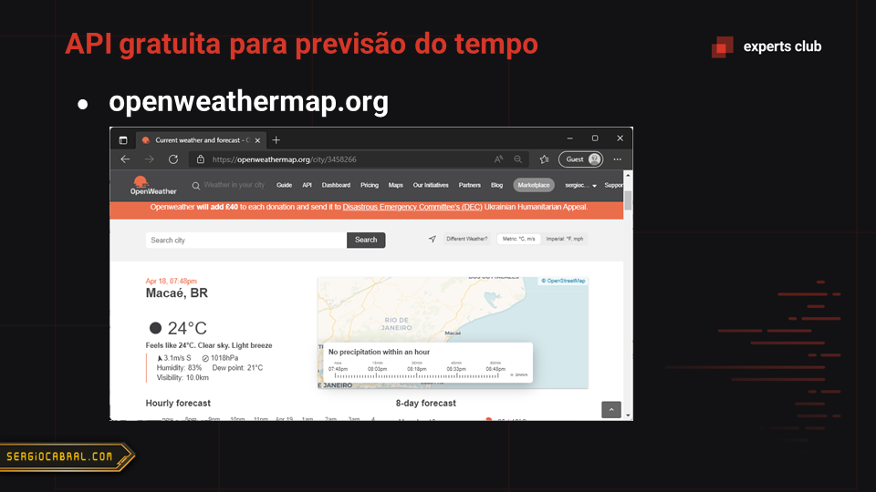
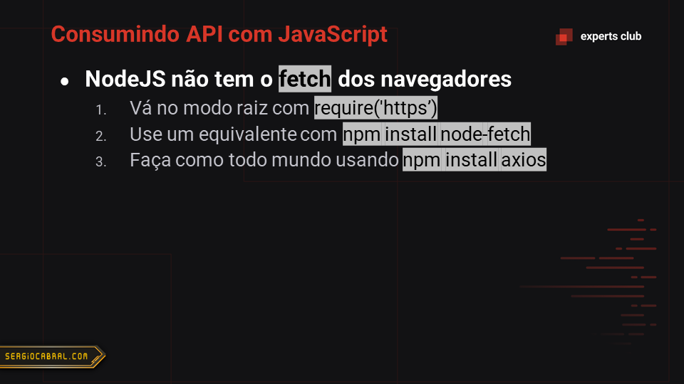

# Twitch Chat Bot com JavaScript

Este repositório é um BOT para o chat da Twitch que responde a previsão do tempo para uma cidade indagada.

Fez parte de uma aula na Rocketseat, no Experts Club.

## Slides da aula

## Expert

|  |
| :-: |
|[sergiocabral.com](https://sergiocabral.com)|
